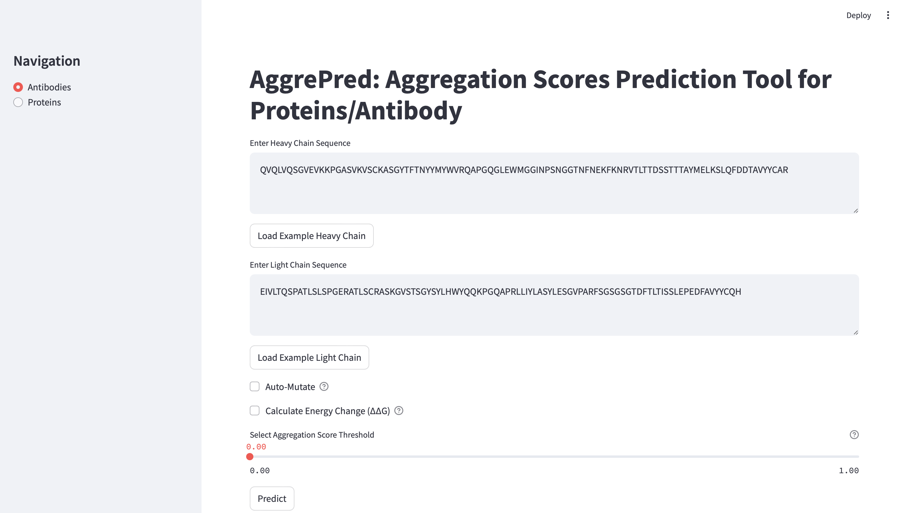

# Aggrepred: Predicting Aggregation Propensity of Proteins/Antibodies

AIDRUG is a project in Audensiel Healthcare, where it aims to use AI applied in Healthcare. 

AggrePred, a tool developed during my internship, aimed at predicting the aggregation propensity of proteins and antibodies based on their sequences. The model utilizes advanced deep learning techniques to analyze sequences and provide insights into aggregation risks.

## Table of Contents

- [Installation](#installation)
- [Usage](#usage)


## Installation


To install and run the AggrePred project, please follow these steps:

1. **Prerequisites**: Ensure you have Python3 installed.
2. **Clone the repository**:
```bash
git clone https://github.com/Lyan168/AIDRUG-AUDENSIEL.git
cd AIDRUG-AUDENSIEL
```

### Dependencies
This conda env is for the application and training code

```conda env create -f environment.yml```

This conda env is for preprocessing part, A3D package, as it required python 2.7.0

```conda env create -f environment_a3d.yml```


### THPLM (Model for calculatign ddg)
```bash
cd AIDRUG-AUDENSIEL/application
git git clone https://github.com/FPPGroup/THPLM.git
```


# Usage

To run the application ,

```bash
cd AIDRUG-AUDENSIEL/application
streamlit run apps.py

```

You can follow your local-host server at http://localhost:8501


